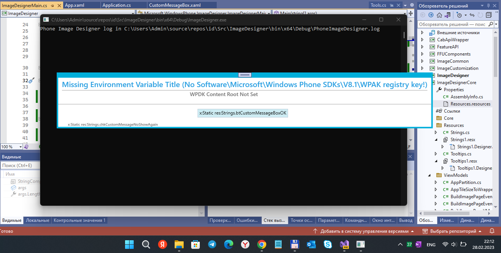

# id

ImageDesigner decomp. 

## Screenshot(s)
<p align="center">
    
</p>

## About 

I found [Microsoft WPID](https://androiddatahost.com/wpidd) (or **id**, in short) and RnD it a little. :)

My idea to learn Image Flashing deals for something great .

I hope that this project can be useful for WP/W10M retromans, and os modders too :)

Show must go on
 
 
## Exe / Libs
```
ImageDesigner +-
ImageDesignerCore +-
ImageDesignerCore.Resources ?
ImageCustomization.Resources ?
FFUComponents +-
ToolsCommon +-
FeatureAPI -+
featuremerger +-
PkgToolBox +-
MCSFOffline +-
CabApiWrapper +-
```

## TODO
- id for w10m
- id doc / how-to
- id wiki / project

## References / Credits / Links

- https://androidmtk.com/use-windows-phone-image-designer-tool (EN)
- https://meshok-sovetov.ru/windows-phone-image-designer/ (RU)
- https://learn.microsoft.com

## ..
AS IS. No support. RnD only.

## .
[m]edia[e]xplorer :: 2023


